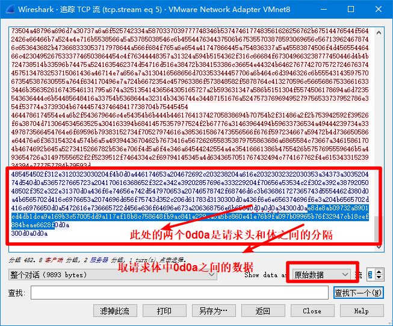

# DecodeSomeJSPWebshell
利用java Swing 简单写的一个jspWebshell 解密工具：
  支持 冰蝎2，冰蝎3，哥斯拉
# 问题： 
## 实现上的问题：
  因为冰蝎webshell管理工具的jsp马其本身在实现的时候：客户端发起命令执行的请求流量是以加密后base64编码传输的，但是服务端发回的命令执行的结果的响应流量的传输内容是直接为AES加密之后的
二进制流，因为我们通过wireshark或者bp抓到的流量中，展现形式通常以看见字符的解码方式去解码，所以导致我们看到的都是一些乱码。因此在实现响应流解密的时候，这里规定要使用响应内容的16进制，
内部的话从16进制还原成bytes ，然后实现AES解密，下面这张图是我们在尝试解密冰蝎响应流量时，要get的部分。

## 解密中存在的问题：
  冰蝎2**首次**持续化通信阶段，服务端响应流量解密不出来，其他正常
  冰蝎3也是一样，没有之前的密钥协商，首次就是第一次，所以第一次的响应流量解密失败，其他正常
  哥斯拉请求响应流量还原正常
